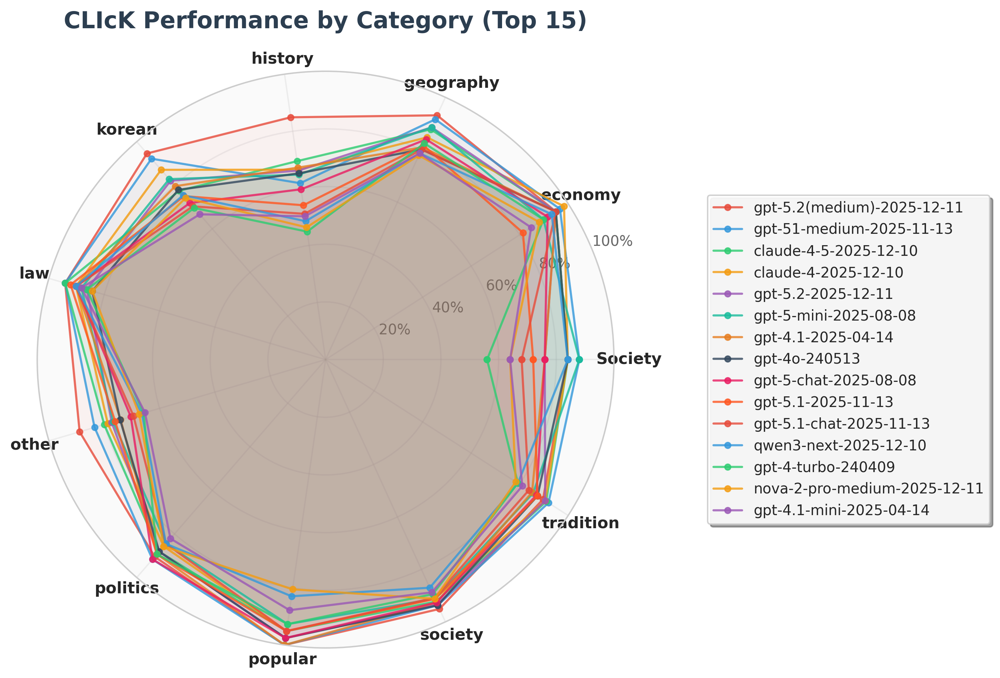
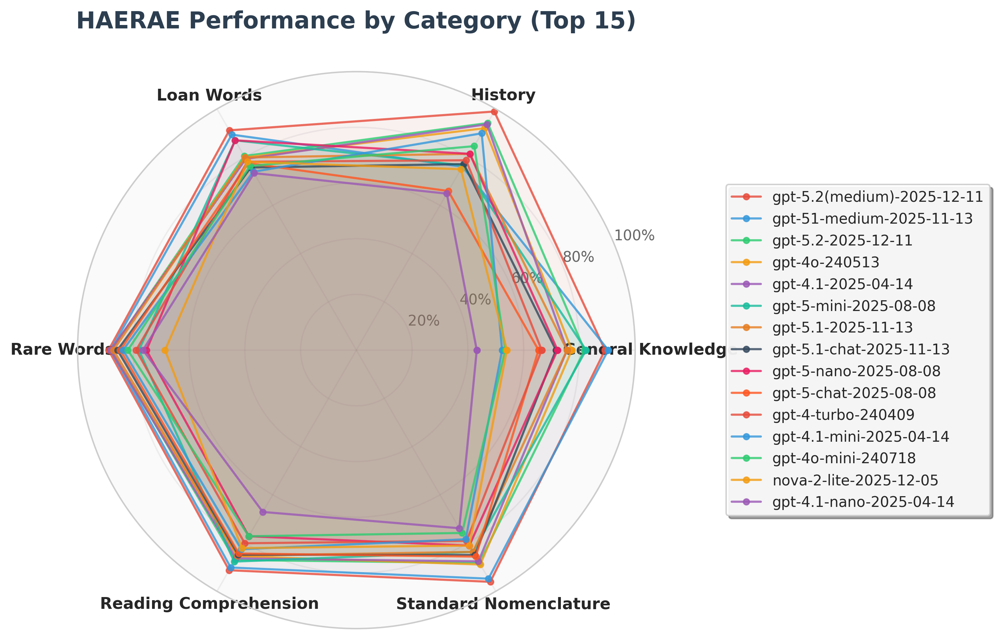
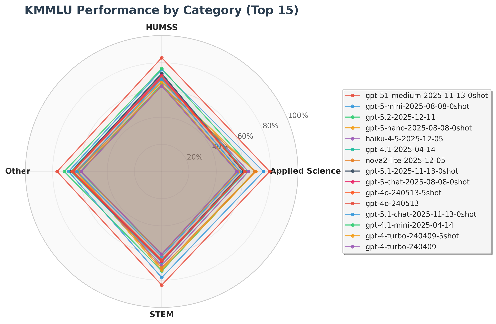
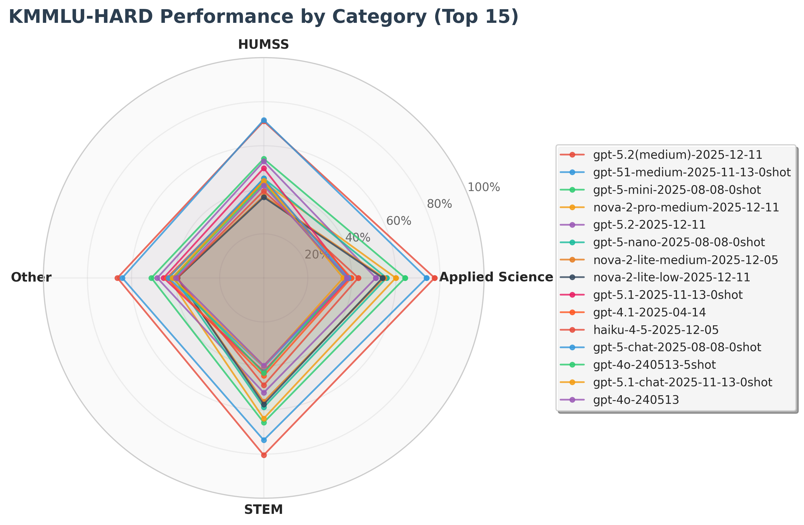

# Korean language proficiency evaluation for LLM/SLM models using KMMLU, CLIcK, HAE-RAE, HRM8K, KoBALT, and KorMedMCQA dataset

## 📋 Overview

With the continuous emergence of various LLM/SLM models, there is a need for robust evaluation datasets for non-English languages such as Korean. KMMLU (Korean Massive Multi-task Language Understanding), CLIcK (Cultural and Linguistic Intelligence in Korean), HAE_RAE_BENCH 1.0, HRM8K, KoBALT, and KorMedMCQA fill this gap by providing rich, well-categorized datasets that focus on cultural, linguistic, mathematical reasoning, advanced linguistic phenomena, and medical knowledge, enabling detailed evaluation of Korean language models. This code performs benchmarking on these datasets with minimal time and effort.

### CLIcK (Cultural and Linguistic Intelligence in Korean)
This dataset assesses Korean language proficiency in the subject areas of Korean Culture (History, Geography, Law, Politics, Society, Tradition, Economy, Pop culture) and Korean Language (Textual, Functional, Grammar). There are a total of 1,995 sample data in 11 categories. This dataset presents 4- or 5-choice multiple choice questions. Depending on the question, additional context is given.

- [Paper](https://arxiv.org/abs/2403.06412), [GitHub](https://github.com/rladmstn1714/CLIcK), [Hugging Face](https://huggingface.co/datasets/EunsuKim/CLIcK)

### HAE_RAE_BENCH 1.0
This dataset evaluates Korean language proficiency in the following 6 categories (General Knowledge, History, Loan Words, Rare Words, Reading Comprehension, Standard Nomenclature). Similar to CLiCK, the task is to solve multiple-choice questions, but no additional context. There are a total of 1,538 sample data in 6 categories.

- [Paper](https://arxiv.org/abs/2309.02706), [GitHub](https://github.com/HAE-RAE/HAE-RAE-BENCH), [Hugging Face](https://huggingface.co/datasets/HAERAE-HUB/HAE_RAE_BENCH_1.0)

### KMMLU
The KMMLU dataset is a large-scale multi-task language understanding evaluation dataset in Korean. It is not a simple translation of the MMLU dataset, but rather data generated from Korean text, allowing us to evaluate how well LLM/SLM works in Korean. It consists of a total of 45 categories and 4 super categories, such as STEM, Appliced ​​Science, HUMSS, and Other.

- [Paper](https://arxiv.org/abs/2402.11548), [Hugging Face](https://huggingface.co/datasets/HAERAE-HUB/KMMLU)

### KMMLU-HARD
This dataset is an extended version of the KMMLU dataset, with more challenging questions. It is designed to further evaluate the limits of Korean NLP models and contains questions that require a particularly high level of comprehension and reasoning skills.

- [Paper](https://arxiv.org/abs/2402.11548), [Hugging Face](https://huggingface.co/datasets/HAERAE-HUB/KMMLU-HARD)

### HRM8K
HRM8K (HAE-RAE Math 8K) is a bilingual math reasoning benchmark for Korean and English, comprising 8,011 instances. It includes Korean School Math (KSM) with 1,428 challenging problems from Korean Olympiad and competition-level exams, and Prior Sets with 6,583 problems from existing English benchmarks (GSM8K, MATH, Omni-MATH, MMMLU). This dataset evaluates mathematical reasoning capabilities in both languages.

- [Paper](https://arxiv.org/abs/2501.02448), [Hugging Face](https://huggingface.co/datasets/HAERAE-HUB/HRM8K)

### KoBALT-700
KoBALT (Korean Benchmark for Advanced Linguistic Tasks) is designed to evaluate LLMs on Korean linguistic phenomena. It consists of 700 expert-written multiple-choice questions (A-J, 10 choices) covering 24 fine-grained linguistic phenomena across 5 core domains: Syntax (300), Semantics (215), Pragmatics (81), Phonetics/Phonology (62), and Morphology (42). Questions are categorized into 3 difficulty levels (1: easy, 2: moderate, 3: hard).

- [Paper](https://arxiv.org/abs/2505.16125), [GitHub](https://github.com/snunlp/KoBALT), [Hugging Face](https://huggingface.co/datasets/snunlp/KoBALT-700)

### KorMedMCQA
KorMedMCQA is a Korean Medical Multiple-Choice Question Answering benchmark derived from professional healthcare licensing examinations conducted in Korea between 2012 and 2024. The dataset contains 7,469 questions from examinations for doctor (2,489 questions), nurse (1,751 questions), pharmacist (1,817 questions), and dentist (1,412 questions), covering a wide range of medical disciplines. This dataset presents 5-choice multiple choice questions with answers numbered 1-5.

- [Paper](https://arxiv.org/abs/2403.01469), [Hugging Face](https://huggingface.co/datasets/sean0042/KorMedMCQA)

## 🆕 What's New

- Dec 26, 2025: Added **Radar Chart Visualization** for Korean LLM evaluation results with interactive charts showing performance by category/supercategory.

- Dec 15, 2025: Added **GPT-5.2** GPT-5.2 (medium) achieved the highest KMMLU-Hard score with 74.63% accuracy (0-shot).

- Dec 6, 2025: Added **HRM8K, KoBALT, and KorMedMCQA** benchmark datasets. Added **AWS Nova 2.0 Lite** (launched at re:Invent 2025) KMMLU benchmark results. Notably, Nova 2.0 Lite, despite being a lightweight model, outperforms GPT-4.1 on KMMLU with 67.02% accuracy (0-shot) compared to GPT-4.1's 65.49%.

- Nov 21, 2025: Added **GPT-5.1, GPT-5.1-chat** benchmark results. GPT-5.1 now supports reasoning_effort="none", while other 5.x models introduce a new "minimal" setting, transforming GPT-5.1 into a flexible spectrum rather than a single fixed-intelligence model. In our benchmark, GPT-5.1 (medium) achieved the highest KMMLU score with 83.65% accuracy (0-shot), whereas GPT-5.1 with the default none setting recorded a score that was approximately 20 percentage points lower, at 62.14% (0-shot).

- Aug 11, 2025: Added **GPT-5** family benchmark results. What is very impressive is the KMMLU score (0-shot 78.53% accuracy) and KMMLU-Hard score of GPT-5-mini (0-shot 61.68% accuracy). For KMMLU-Hard, many open-source models struggle to even surpass 30% accuracy.

- Apr 17, 2025: Added **GPT-4.1** family benchmark results. GPT-4.1-mini is an improvement over GPT-4o-mini and is closer to GPT-4o. GPT-4.1 outperforms GPT-4o.

- Feb 28, 2025: Added **Phi-4-mini-instruct** benchmark results.

- Feb 2, 2025: Added **Phi-4** benchmark results / Added Azure AI Foundry deployment options. Phi-4 outperforms Phi-3.5-MoE in some metrics, such as CLIcK and KMMLU.

- Aug 29, 2024: Added 5-shot experiments for **KMMLU** and **KMMLU-HARD** benchmark datasets. For Llama-3.1-8B-Instruct, adding an example with 5-shot does not give a proper answer based on Korean language. The results may vary depending on the experimental environment, but it seems that an appropriate system prompt is needed. (Please note that we did not use any system prompt.)

- Aug 25, 2024: Added experimental results for **KMMLU** and **KMMLU-HARD** benchmark datasets. Added **Phi-3-mini-128K-instruct (June version)** benchmark results.

- Aug 22, 2024: Added **Phi-3-5-mini-instruct** and **Phi-3.5-MoE-instruct** benchmark results. Phi-3.5 is Microsoft's latest open source model that has begun to properly support multiple languages, and its Korean performance has been greatly improved, as shown in the benchmark results below.

- Aug 22, 2024: Added **Llama-3-1-8B-instruct** benchmark results. Of course, fine-tuned Llama-3.1 with Korean dataset may perform better, but we only compared it with the vanilla model.

- Aug 9, 2024: Added Azure OpenAI **GPT-3.5-turbo (2023-06-13)**, **GPT-4-turbo (2024-04-09)**, **GPT-4o (2024-05-13)**, and **GPT-4o-mini (2024-07-18)** benchmark results.

## ⚙️ Implementation

The code skeleton is based on https://github.com/corca-ai/evaluating-gpt-4o-on-CLIcK, but significant improvements have been made:

- **Multi-provider support**: Azure OpenAI, AWS Bedrock, OpenAI, Azure ML, Azure AI Foundry, and Hugging Face
- **Parallel processing**: Efficient batch processing with configurable concurrency and chunk-based file merging
- **Robust error handling**: Content filtering, rate limiting, and throttling exception handling with configurable wait times
- **Advanced parsing**: Custom output parsers supporting reasoning models with multiple response format detection
- **Adaptive prompts**: Reasoning-aware system prompts with configurable effort levels (none/minimal/low/medium/high)
- **Comprehensive logging**: Debug mode with detailed request/response logging for troubleshooting 

## 📊 Visualization

### Radar Chart Generator

```bash
# Creating a radar chart
uv run python -c "
from utils.radar_chart_generator import RadarChartGenerator
generator = RadarChartGenerator()
generator.generate_all_charts(['CLIcK', 'KMMLU', 'HAERAE'], top_n=10)
"

# Or use a juputer notebook
jupyter notebook radar_chart_visualization.ipynb
```

### Radar Charts

| CLIcK Performance by Category | HAERAE Performance by Supercategory |
|:---:|:---:|
|  |   |

| KMMLU Performance by Category | KMMLU-Hard Performance by Category |
|:---:|:---:|
|  |  |

## 📈 Results

### Notes
The numbers in the table below are the average accuracy (%). For Azure OpenAI models, a few questions are filtered out due to the content filtering feature, but this only happens between 1-5 samples in the entire dataset, so the impact is not significant. 

The prompt is the same as the CLIcK paper prompt. The experimental results may vary depending on the system prompt, context, and parameters. The experimental results below were given with max_tokens=512, temperature=0.01 without using few-shot, context, or system prompt.

**Important for HRM8K (especially OMNI_MATH subset):**
- OMNI_MATH problems are extremely complex and require significantly more tokens
- Recommended settings: `--max_tokens 5000` or higher
- For reasoning models (e.g., Nova with reasoning), consider using lower reasoning effort to reduce token consumption
- If you encounter `stopReason: 'max_tokens'`, increase the token limit further

**Reasoning Configuration:**
- `REASONING_ENABLED=true` enables reasoning mode for system prompts across all providers
- `REASONING_EFFORT` levels: none (minimal reasoning), minimal (1-2 sentences), low (2-3 sentences), medium (3-4 sentences), high (4-6 sentences)
- For Bedrock Nova models, reasoning config is also applied to the model's native reasoning capability
- For other providers, reasoning is handled through enhanced system prompts

**Throttling Protection:**
- `WAIT_TIME` environment variable controls delay when throttling errors occur (default: 30 seconds)
- Only activates on `ThrottlingException`, `Too many requests`, or similar throttling errors
- Normal processing continues without delays

Since most of them are ChatCompletion or instruction fine-tuned models, the variation may be large compared to the results of other group's experiments. However, our experimental results show that the trend follows similarly under the same experimental conditions. (e.g., GPT-4o: 70.57/GPT-4o-mini: 60.31 in Experimental Condition 1; GPT-4o: 67.76/GPT-4o-mini: 57.53 in Experimental Condition 2).

### Model Version
<details>
<summary>Click to view model versions</summary>

- GPT-5.2 (medium): 2025-12-11 model version (reasoning_effort="medium")
- GPT-5.2: 2025-12-11 model version (reasoning_effort="none" as default)
- Nova 2.0 Lite: us.amazon.nova-2-lite-v1:0 model (reasoning mode: medium)
- GPT-5.1 (medium): 2025-11-13 model version (reasoning_effort="medium")
- GPT-5.1: 2025-11-13 model version (reasoning_effort="none" as default)
- GPT-5.1-chat: 2025-11-13 model version 
- GPT-5-chat: 2025-08-08 model version 
- GPT-5-mini: 2025-08-08 model version (reasoning_effort="medium" as default)
- GPT-5-nano: 2025-08-08 model version (reasoning_effort="medium" as default)
- GPT-4.1: 2025-04-14 model version
- GPT-4.1-mini: 2025-04-14 model version
- GPT-4.1-nano: 2025-04-14 model version
- GPT-4o: 2024-05-13 model version
- GPT-4o-mini: 2024-07-18 model version
- GPT-4-turbo: 2024-04-09 model version
- GPT-3.5-turbo: 2023-06-13 model version

</details>

### CLIcK

#### Proprietary models

##### Accuracy by supercategory
| supercategory   |   GPT-5.2(medium) |   GPT-5.2 |   Nova 2 Pro - Preview(medium) |   Nova 2 Lite(medium) |   GPT-5.1(medium) |   GPT-5.1 |   GPT-5.1-chat |   GPT-5-chat |   GPT-5-mini |   GPT-5-nano |   GPT-4.1 |   GPT-4.1-mini |   GPT-4.1-nano |   GPT-4o |   GPT-4o-mini |   GPT-4-turbo |   GPT-3.5-turbo |
|:----------------|------------------:|----------:|-------------------------------:|----------------------:|------------------:|----------:|---------------:|-------------:|-------------:|-------------:|----------:|---------------:|---------------:|---------:|--------------:|--------------:|----------------:|
| Culture         |             89.95 |     83.72 |                          71.82 |                 66.02 |             89.96 |     82.93 |          79.3  |        82.96 |        81.51 |        72.78 |     81.65 |          72.81 |          62.47 |    81.89 |         70.95 |         73.61 |           53.38 |
| Language        |             92.92 |     80.77 |                          75.69 |                 69.69 |             89.45 |     76.27 |          74.76 |        75.71 |        83.8  |        70.24 |     78.31 |          70.62 |          58.62 |    77.54 |         63.54 |         71.23 |           46    |
| **Overall**     |             90.92 |     82.75 |                          73.08 |                 67.22 |             89.81 |     81    |          77.97 |        80.84 |        82.17 |        72.05 |     80.55 |          72.09 |          61.21 |    80.46 |         68.5  |         72.82 |           50.98 |

<details>
<summary>Click to view Accuracy by category</summary>

##### Accuracy by category
| supercategory   | category    |   GPT-5.2(medium) |   GPT-5.2 |   Nova 2 Pro - Preview(medium) |   Nova 2 Lite(medium) |   GPT-5.1(medium) |   GPT-5.1 |   GPT-5.1-chat |   GPT-5-chat |   GPT-5-mini |   GPT-5-nano |   GPT-4.1 |   GPT-4.1-mini |   GPT-4.1-nano |   GPT-4o |   GPT-4o-mini |   GPT-4-turbo |   GPT-3.5-turbo |
|:----------------|:------------|------------------:|----------:|-------------------------------:|----------------------:|------------------:|----------:|---------------:|-------------:|-------------:|-------------:|----------:|---------------:|---------------:|---------:|--------------:|--------------:|----------------:|
| Culture         | Economy     |             94.92 |     94.92 |                          88.14 |                 88.14 |             96.61 |     81.36 |          94.92 |        91.53 |        89.83 |        88.14 |     94.92 |          84.75 |          86.44 |    94.92 |         83.05 |         89.83 |           64.41 |
| Culture         | Geography   |             93.13 |     88.55 |                          77.86 |                 69.47 |             91.6  |     81.68 |          80.15 |        83.97 |        88.55 |        79.39 |     80.92 |          78.63 |          64.89 |    80.15 |         77.86 |         82.44 |           53.44 |
| Culture         | History     |             84.7  |     67.16 |                          46.43 |                 39.64 |             81.5  |     68.7  |          60.45 |        73.64 |        70.77 |        48.8  |     68.52 |          51.11 |          38.89 |    66.92 |         48.4  |         46.4  |           31.79 |
| Culture         | Law         |             85.39 |     75.34 |                          58.45 |                 52.05 |             85.84 |     80.37 |          70.32 |        67.58 |        67.12 |        54.34 |     71.23 |          58.45 |          48.4  |    70.78 |         57.53 |         61.19 |           41.55 |
| Culture         | Politics    |             90.48 |     88.1  |                          85.71 |                 80.95 |             91.67 |     89.29 |          84.52 |        91.67 |        84.52 |        85.71 |     89.29 |          82.14 |          75    |    88.1  |         83.33 |         89.29 |           65.48 |
| Culture         | Pop Culture |            100    |     97.56 |                          80.49 |                 80.49 |            100    |     95.12 |          95.12 |        97.56 |        92.68 |        85.37 |    100    |          87.8  |          85.37 |    97.56 |         85.37 |         92.68 |           75.61 |
| Culture         | Society     |             94.17 |     91.91 |                          89    |                 84.14 |             93.2  |     89.64 |          89    |        91.26 |        90.94 |        88.35 |     91.26 |          86.73 |          77.67 |    92.88 |         85.44 |         86.73 |           71.2  |
| Culture         | Tradition   |             89.64 |     90.54 |                          78.38 |                 71.62 |             91.89 |     87.39 |          83.78 |        86.94 |        85.59 |        81.08 |     85.14 |          81.08 |          67.12 |    87.39 |         74.77 |         79.28 |           55.86 |
| Language        | Functional  |             94.4  |     90.4  |                          81.6  |                 74.4  |             92.86 |     78.57 |          85.71 |        85.71 |        92.86 |        78.57 |     87.2  |          73.6  |          53.6  |    84.8  |         64.8  |         80    |           40    |
| Language        | Grammar     |             87.92 |     62.5  |                          58.33 |                 47.5  |             84.05 |     57.76 |          55.17 |        58.62 |        73.71 |        56.9  |     60    |          50    |          40.42 |    57.08 |         42.5  |         47.5  |           30    |
| Language        | Textual     |             96.49 |     91.93 |                          87.72 |                 86.32 |             93.68 |     91.23 |          90.18 |        89.12 |        91.58 |        80.7  |     89.82 |          86.67 |          76.14 |    91.58 |         80.7  |         87.37 |           62.11 |
</details>

#### Open-Source models
##### Accuracy by supercategory
| supercategory   |   gpt-oss-120b |   Phi-4-mini-instruct |   Phi-4 |   Phi-3.5-mini-instruct |   Phi-3.5-MoE-instruct |   Phi-3-mini-128k-instruct-June |   Llama-3.1-8B-Instruct |
|:----------------|---------------:|----------------------:|--------:|------------------------:|-----------------------:|--------------------------------:|------------------------:|
| Culture         |          60.28 |                 43.05 |   57.84 |                   43.77 |                  58.44 |                           29.74 |                   51.15 |
| Language        |          39.17 |                 42.31 |   61.85 |                   41.38 |                  52.31 |                           27.85 |                   40.92 |
| **Overall**     |          53.26 |                 42.81 |   59.15 |                   42.99 |                  56.44 |                           29.12 |                   47.82 |

<details>
<summary>Click to view Accuracy by category</summary>

##### Accuracy by category
| supercategory   | category    | gpt-oss-120b   |   Phi-4-mini-instruct |   Phi-4 |   Phi-3.5-mini-instruct |   Phi-3.5-MoE-instruct |   Phi-3-mini-128k-instruct-June |   Llama-3.1-8B-Instruct |
|:----------------|:------------|:---------------|----------------------:|--------:|------------------------:|-----------------------:|--------------------------------:|------------------------:|
| Culture         | Economy     | 91.53          |                 59.32 |   76.27 |                   61.02 |                  77.97 |                           28.81 |                   66.1  |
| Culture         | Geography   | -              |                 39.69 |   55.73 |                   45.8  |                  60.31 |                           29.01 |                   54.2  |
| Culture         | History     | 20.09          |                 27.5  |   27.5  |                   26.15 |                  33.93 |                           30    |                   29.64 |
| Culture         | Law         | 72.62          |                 36.99 |   50.23 |                   32.42 |                  52.51 |                           22.83 |                   44.29 |
| Culture         | Politics    | 80.49          |                 52.38 |   76.19 |                   54.76 |                  70.24 |                           33.33 |                   59.52 |
| Culture         | Pop Culture | 78.96          |                 63.41 |   70.73 |                   60.98 |                  80.49 |                           34.15 |                   60.98 |
| Culture         | Society     | 57.21          |                 52.75 |   75.08 |                   54.37 |                  74.43 |                           31.72 |                   65.05 |
| Culture         | Tradition   | 57.21          |                 45.5  |   66.67 |                   47.75 |                  58.11 |                           31.98 |                   54.95 |
| Language        | Functional  | 57.14          |                 42.4  |   66.4  |                   37.6  |                  48    |                           24    |                   32.8  |
| Language        | Grammar     | 16.38          |                 28.33 |   40    |                   27.5  |                  29.58 |                           23.33 |                   22.92 |
| Language        | Textual     | 56.84          |                 54.04 |   78.25 |                   54.74 |                  73.33 |                           33.33 |                   59.65 |
</details>

### HAE_RAE_BENCH 1.0

#### Proprietary models

| category              |   GPT-5.2(medium) |   GPT-5.2 |   Nova 2 Lite(medium) |   GPT-5.1(medium) |   GPT-5.1 |   GPT-5.1-chat |   GPT-5-chat |   GPT-5-mini |   GPT-5-nano |   GPT-4.1 |   GPT-4.1-mini |   GPT-4.1-nano |   GPT-4o |   GPT-4o-mini |   GPT-4-turbo |   GPT-3.5-turbo |
|:----------------------|------------------:|----------:|----------------:|------------------:|----------:|---------------:|-------------:|-------------:|-------------:|----------:|---------------:|---------------:|---------:|--------------:|--------------:|----------------:|
| General Knowledge     |             89.2  |     81.82 |           53.98 |             90.34 |     75.57 |          71.59 |        69.28 |        82.39 |        72.16 |     75.57 |          52.27 |          43.18 |    77.27 |         53.41 |         66.48 |           40.91 |
| History               |             98.94 |     94.15 |           75    |             96.62 |     91.07 |          91.77 |        89.86 |        91.14 |        85.96 |     93.62 |          89.89 |          64.89 |    92.02 |         84.57 |         78.72 |           30.32 |
| Loan Words            |             91.12 |     80.47 |           78.11 |             89.35 |     79.88 |          75.74 |        82.39 |        86.98 |        86.98 |     79.29 |          73.96 |          73.37 |    79.88 |         76.33 |         78.11 |           59.17 |
| Rare Words            |             88.89 |     87.9  |           68.64 |             88.15 |     87.16 |          85.68 |        86.84 |        78.02 |        75.31 |     88.15 |          83.7  |          76.54 |    87.9  |         81.98 |         79.01 |           61.23 |
| Reading Comprehension |             91.28 |     87.02 |           82.1  |             90.16 |     85.23 |          84.79 |        86.27 |        87.7  |        77.18 |     86.35 |          82.55 |          67.11 |    85.46 |         77.18 |         80.09 |           56.15 |
| Standard Nomenclature |             96.08 |     88.24 |           81.05 |             94.77 |     83.66 |          84.97 |        85.62 |        83.66 |        81.05 |     87.58 |          78.43 |          73.86 |    88.89 |         75.82 |         79.08 |           53.59 |
| **Overall**           |             91.81 |     86.93 |           73.93 |             90.65 |     84.52 |          83.22 |        84.32 |        84.35 |        78.6  |     85.83 |          78.93 |          67.95 |    85.7  |         76.4  |         77.76 |           52.67 |

#### Open-Source models

| category              |   gpt-oss-120b |   Phi-4-mini-instruct |   Phi-4 |   Phi-3.5-MoE-instruct |   Phi-3.5-mini-instruct |   Phi-3-mini-128k-instruct-June |   Llama-3.1-8B-Instruct |
|:----------------------|---------------:|----------------------:|--------:|-----------------------:|------------------------:|--------------------------------:|------------------------:|
| General Knowledge     |          16.48 |                 28.41 |   38.07 |                  39.77 |                   31.25 |                           28.41 |                   34.66 |
| History               |          48.91 |                 31.38 |   37.77 |                  60.64 |                   32.45 |                           22.34 |                   44.15 |
| Loan Words            |          31.95 |                 52.66 |   61.54 |                  70.41 |                   47.93 |                           35.5  |                   63.31 |
| Rare Words            |          43.95 |                 51.6  |   62.72 |                  63.95 |                   55.06 |                           42.96 |                   63.21 |
| Reading Comprehension |          34.9  |                 43.18 |   71.14 |                  64.43 |                   42.95 |                           41.16 |                   51.9  |
| Standard Nomenclature |          56.21 |                 54.9  |   63.4  |                  66.01 |                   44.44 |                           32.68 |                   58.82 |
| **Overall**           |          38.66 |                 44.47 |   59.23 |                  61.83 |                   44.21 |                           36.41 |                   53.9  |

### KMMLU (0-shot)

#### Proprietary models
##### Accuracy by supercategory
| supercategory   |   GPT-5.2 |   Nova 2.0 Lite |   GPT-5.1 |   GPT-5.1(medium) |   GPT-5.1-chat |   GPT-5-chat |   GPT-5-mini |   GPT-5-nano |   GPT-4.1 |   GPT-4.1-mini |   GPT-4.1-nano |   GPT-4o |   GPT-4o-mini |   GPT-4-turbo |   GPT-3.5-turbo |
|:----------------|----------:|----------------:|----------:|------------------:|---------------:|-------------:|-------------:|-------------:|----------:|---------------:|---------------:|---------:|--------------:|--------------:|----------------:|
| Applied Science |     68.92 |           68.06 |     62.14 |             83.65 |          59.96 |        62.64 |        76.94 |        69.97 |     61.98 |          56.21 |          45.84 |    61.52 |         49.29 |         55.98 |           38.47 |
| HUMSS           |     75.79 |           63.24 |     72.32 |             83.7  |          68.18 |        70.78 |        75.21 |        66.44 |     71.7  |          64.11 |          51.56 |    69.45 |         56.59 |         63    |           40.9  |
| Other           |     70.62 |           63.32 |     66.2  |             80.96 |          63.15 |        65.81 |        73.12 |        65.3  |     65.29 |          58.26 |          47.93 |    63.79 |         52.35 |         57.53 |           40.19 |
| STEM            |     73.16 |           70.9  |     66.62 |             86.18 |          64.04 |        67.27 |        79.32 |        73.33 |     66.56 |          61.17 |          50.78 |    65.16 |         54.74 |         60.84 |           42.24 |
| **Overall**     |     71.54 |           67.02 |     65.9  |             83.73 |          63.11 |        65.92 |        76.47 |        69.28 |     65.49 |          59.26 |          48.57 |    64.26 |         52.63 |         58.75 |           40.3  |

<details>
<summary>Click to view Accuracy by category</summary>

##### Accuracy by category
| supercategory   | category                                   |   GPT-5.2 |   Nova 2.0 Lite |   GPT-5.1 |   GPT-5.1(medium) |   GPT-5.1-chat |   GPT-5-chat |   GPT-5-mini |   GPT-5-nano |   GPT-4.1 |   GPT-4.1-mini |   GPT-4.1-nano |   GPT-4o |   GPT-4o-mini |   GPT-4-turbo |   GPT-3.5-turbo |
|:----------------|:-------------------------------------------|----------:|----------------:|----------:|------------------:|---------------:|-------------:|-------------:|-------------:|----------:|---------------:|---------------:|---------:|--------------:|--------------:|----------------:|
| Applied Science | Aviation-Engineering-and-Maintenance       |     77.41 |           70.8  |     71.01 |             87.55 |          67.88 |        71.6  |        79.28 |        72.12 |     69.8  |          61.4  |          47.2  |    69.8  |         50.4  |         61.92 |           39    |
| Applied Science | Electronics-Engineering                    |     81.2  |           86.7  |     72.7  |             94.2  |          70.6  |        74.8  |        91.6  |        87.3  |     73.3  |          69.6  |          58.1  |    73.2  |         64.5  |         70.2  |           47.1  |
| Applied Science | Energy-Management                          |     58.67 |           63.6  |     54.06 |             82    |          51.47 |        54.18 |        72.96 |        66.46 |     53.7  |          45.4  |          36.3  |    50.3  |         39.5  |         43.6  |           33.9  |
| Applied Science | Environmental-Science                      |     54.32 |           62.4  |     45.91 |             75.53 |          42.35 |        46.56 |        70.23 |        61.96 |     47.8  |          41.9  |          35.8  |    45.82 |         36.5  |         42.7  |           30.51 |
| Applied Science | Gas-Technology-and-Engineering             |     59.88 |           66.1  |     52.7  |             78.03 |          52.53 |        51.59 |        71.69 |        65.16 |     51.2  |          48.9  |          39.9  |    50.7  |         44.6  |         48.3  |           35    |
| Applied Science | Geomatics                                  |     60.2  |           60.1  |     52.1  |             79.2  |          51.5  |        51.9  |        71    |        62.2  |     54.9  |          49.3  |          42.6  |    56.4  |         43.7  |         47.3  |           35.7  |
| Applied Science | Industrial-Engineer                        |     70.2  |           63    |     63.2  |             79    |          59.9  |        62    |        74    |        64.6  |     62    |          55.6  |          48.1  |    61.7  |         53.1  |         57    |           41.12 |
| Applied Science | Machine-Design-and-Manufacturing           |     76.4  |           72.9  |     68.3  |             88.8  |          65.4  |        67.8  |        81.6  |        72.6  |     67.7  |          60.8  |          45.9  |    68.4  |         53    |         61    |           37.9  |
| Applied Science | Maritime-Engineering                       |     73.5  |           62.5  |     68.83 |             87.33 |          66.33 |        70.33 |        79.33 |        72.5  |     68.67 |          60.67 |          44.5  |    67    |         52.5  |         60.17 |           42.67 |
| Applied Science | Nondestructive-Testing                     |     69.98 |           61.5  |     64.9  |             76.84 |          62.14 |        64.75 |        69.79 |        66.84 |     63.9  |          59.9  |          48.1  |    65.2  |         48    |         59.7  |           35.8  |
| Applied Science | Railway-and-Automotive-Engineering         |     63.55 |           66.1  |     54.95 |             83.65 |          50.51 |        57.45 |        77.11 |        69.79 |     55.9  |          50.3  |          42.9  |    53.9  |         40.9  |         48.6  |           32.5  |
| Applied Science | Telecommunications-and-Wireless-Technology |     82.5  |           78.8  |     76.5  |             89.6  |          77.1  |        78.6  |        83.8  |        78.1  |     77.6  |          72.5  |          60.1  |    77.8  |         66.1  |         73    |           52.24 |
| HUMSS           | Accounting                                 |     80    |           62    |     77    |             97    |          62    |        71    |        92    |        78    |     71    |          64    |          38    |    72    |         48    |         59    |           30    |
| HUMSS           | Criminal-Law                               |     56.5  |           35    |     52.5  |             63    |          47    |        47.5  |        48    |        45    |     54    |          43    |          38.5  |    52.5  |         37    |         46.5  |           40.5  |
| HUMSS           | Economics                                  |     81.54 |           66.92 |     80    |             86.15 |          71.54 |        78.46 |        83.85 |        74.62 |     77.69 |          74.62 |          56.92 |    74.62 |         64.62 |         65.38 |           43.85 |
| HUMSS           | Education                                  |     89    |           77    |     88    |             93    |          80    |        85    |        89    |        77    |     86    |          80    |          59    |    83    |         70    |         69    |           43    |
| HUMSS           | Korean-History                             |     69    |           29    |     55.56 |             82    |          52.22 |        55.56 |        65.56 |        42.22 |     53    |          39    |          33    |    56    |         32    |         41    |           26    |
| HUMSS           | Law                                        |     69    |           51.2  |     67.5  |             75.6  |          63.7  |        65.9  |        63.84 |        53.43 |     65.9  |          59.1  |          45.1  |    65.8  |         50.6  |         56.7  |           38.23 |
| HUMSS           | Management                                 |     81.4  |           70.4  |     77.4  |             89.5  |          74    |        76    |        82.9  |        73.7  |     78.3  |          69.2  |          59    |    74.2  |         64.2  |         70.7  |           47.9  |
| HUMSS           | Political-Science-and-Sociology            |     82    |           68.33 |     80    |             88.67 |          77.33 |        80.33 |        79.67 |        68    |     81    |          68.33 |          56    |    79.67 |         62.33 |         72.67 |           46.67 |
| HUMSS           | Psychology                                 |     74.3  |           57.6  |     71.3  |             81.1  |          64.8  |        67.8  |        70.5  |        61.2  |     68.3  |          59    |          45.6  |    66.4  |         50.4  |         57.3  |           32.8  |
| HUMSS           | Social-Welfare                             |     82.5  |           84.2  |     76.9  |             92.4  |          76.5  |        78.4  |        89.9  |        86.1  |     78.3  |          76    |          62.8  |    74.5  |         67.7  |         73.2  |           46.4  |
| HUMSS           | Taxation                                   |     56.5  |           40    |     54    |             66    |          46.5  |        49.5  |        47    |        36    |     54    |          42.5  |          35.5  |    51    |         39.5  |         44    |           33.5  |
| Other           | Agricultural-Sciences                      |     63.86 |           52.5  |     57.68 |             71.63 |          51.82 |        56.26 |        61.86 |        54.3  |     57    |          47.8  |          37.4  |    53.9  |         41.8  |         47.58 |           30.1  |
| Other           | Construction                               |     61.44 |           55.3  |     52.89 |             73.94 |          50.82 |        53.64 |        63.67 |        55.4  |     52.2  |          47.4  |          38.9  |    50.7  |         41.8  |         46    |           33.2  |
| Other           | Fashion                                    |     71.59 |           55.2  |     67.76 |             76.84 |          63.57 |        67.07 |        69.18 |        60.91 |     67.7  |          57.9  |          48.4  |    65.8  |         51.1  |         58.28 |           39.7  |
| Other           | Food-Processing                            |     70.7  |           61    |     67.4  |             79.9  |          64.95 |        66.87 |        74.24 |        66.5  |     66.5  |          59.6  |          45.3  |    64.9  |         51.7  |         57.4  |           37.3  |
| Other           | Health                                     |     82    |           79    |     80    |             92    |          86    |        82    |        83    |        78    |     84    |          74    |          63    |    80    |         69    |         70    |           50    |
| Other           | Interior-Architecture-and-Design           |     81.2  |           72.8  |     79.2  |             89.3  |          77.4  |        79.3  |        81.2  |        72.7  |     79.6  |          71.4  |          57.7  |    77.6  |         64    |         71.1  |           48.2  |
| Other           | Marketing                                  |     91.4  |           83.3  |     89.9  |             93    |          88.1  |        88.4  |        88.8  |        84.6  |     90.3  |          87.6  |          78.6  |    88.9  |         83.1  |         86.26 |           63.6  |
| Other           | Patent                                     |     61    |           35    |     61    |             65    |          46    |        60    |        52    |        29    |     57    |          51    |          45    |    52    |         33    |         46    |           40    |
| Other           | Public-Safety                              |     60.66 |           57.1  |     57.73 |             76    |          52.05 |        56.52 |        64.86 |        57.21 |     53.4  |          46    |          39.6  |    53.2  |         44.3  |         48.2  |           36.2  |
| Other           | Real-Estate                                |     66.5  |           51    |     65    |             71.5  |          59.5  |        61.5  |        66    |        57    |     62.5  |          54.5  |          48.5  |    64.5  |         49    |         56.5  |           38    |
| Other           | Refrigerating-Machinery                    |     64.36 |           73.1  |     54.64 |             88.19 |          54.02 |        56.84 |        81.06 |        73.6  |     55.1  |          48.3  |          36.2  |    54.7  |         41.9  |         45.7  |           32.7  |
| STEM            | Biology                                    |     73.19 |           54.2  |     66.73 |             84.49 |          61.96 |        67.76 |        73.33 |        63.23 |     66.4  |          54.6  |          38.7  |    63.1  |         45.5  |         52.83 |           31.84 |
| STEM            | Chemical-Engineering                       |     73.16 |           83.8  |     64.09 |             90.89 |          64.02 |        66.17 |        86.91 |        82.45 |     67.7  |          61.4  |          50.4  |    65.1  |         55.8  |         62.6  |           38.5  |
| STEM            | Chemistry                                  |     76.51 |           83.67 |     73.93 |             92.5  |          69.81 |        71.79 |        89.82 |        86.67 |     71.5  |          64.33 |          54.83 |    68.67 |         57.33 |         64.33 |           39.67 |
| STEM            | Civil-Engineering                          |     62.9  |           60.7  |     54.5  |             79.6  |          51    |        56.6  |        70.5  |        65    |     52.9  |          50.4  |          42.7  |    54.3  |         46.9  |         50.3  |           38.3  |
| STEM            | Computer-Science                           |     91.2  |           84.7  |     88.9  |             94.7  |          87.5  |        88.9  |        91    |        86.6  |     89.2  |          85    |          76.2  |    88.2  |         80.1  |         84.8  |           65.7  |
| STEM            | Ecology                                    |     71.9  |           60.4  |     66.7  |             77.5  |          61.9  |        65.1  |        69.1  |        61.6  |     64.5  |          58.8  |          53.3  |    64.4  |         54.3  |         60    |           42.9  |
| STEM            | Electrical-Engineering                     |     53.82 |           57.7  |     45.8  |             74    |          43.2  |        48.3  |        64.1  |        57.4  |     46.2  |          43.9  |          35.8  |    46    |         38.5  |         44.1  |           31.7  |
| STEM            | Information-Technology                     |     88.3  |           88.4  |     85.3  |             94.9  |          84.3  |        85.3  |        91.6  |        88.2  |     86    |          82.6  |          72.2  |    83.6  |         78.4  |         81.2  |           63.78 |
| STEM            | Materials-Engineering                      |     80.95 |           66.9  |     74.33 |             87.77 |          71.65 |        73.47 |        78.18 |        70.6  |     72.4  |          64.6  |          47.9  |    69.4  |         52.1  |         64.55 |           39.69 |
| STEM            | Math                                       |     36.33 |           82.67 |     30    |             93    |          26.67 |        32.67 |        91.33 |        89    |     32    |          35.33 |          28.33 |    32.67 |         30    |         28.67 |           26.33 |
| STEM            | Mechanical-Engineering                     |     72.1  |           70.1  |     60.1  |             86.98 |          59.08 |        61.63 |        80.21 |        73.06 |     61.1  |          55.1  |          44.1  |    60    |         46.9  |         54.7  |           34.2  |
</details>

#### Open-Source models

| supercategory   |   Phi-4-mini |   Phi-4 |   Phi-3.5-MoE-instruct |   Phi-3.5-mini-instruct |   Phi-3-mini-128k-instruct-June |   Llama-3.1-8B-Instruct |
|:----------------|-------------:|--------:|-----------------------:|------------------------:|--------------------------------:|------------------------:|
| Applied Science |        36.46 |   47.97 |                  45.15 |                   35.8  |                           31.68 |                   37.03 |
| HUMSS           |        35.52 |   54.27 |                  49.75 |                   31.56 |                           26.47 |                   37.29 |
| Other           |        36.26 |   49.07 |                  47.24 |                   35.45 |                           31.01 |                   39.15 |
| STEM            |        39.31 |   52    |                  49.08 |                   38.54 |                           31.9  |                   40.42 |
| **Overall**     |        37.08 |   50.3  |                  47.43 |                   35.87 |                           30.82 |                   38.54 |


### KMMLU-HARD (0-shot)

#### Proprietary models
##### Accuracy by supercategory
| supercategory   |   GPT-5.2(medium) |   GPT-5.2 |   Nova 2 Pro - Preview(medium) |   Nova 2 Lite(medium) |   GPT-5.1 |   GPT-5.1(medium) |   GPT-5.1-chat |   GPT-5-chat |   GPT-5-mini |   GPT-5-nano |   GPT-4.1 |   GPT-4.1-mini |   GPT-4.1-nano |   GPT-4o |   GPT-4o-mini |   GPT-4-turbo |   GPT-3.5-turbo |
|:----------------|------------------:|----------:|-------------------------------:|----------------------:|----------:|------------------:|---------------:|-------------:|-------------:|-------------:|----------:|---------------:|---------------:|---------:|--------------:|--------------:|----------------:|
| Applied Science |             76.94 |     50.76 |                          59.08 |                 53.91 |     39.32 |             74.24 |          36.87 |        38.97 |        64.7  |        54.96 |     39.08 |          34.92 |          23.75 |    37.12 |         22.25 |         29.17 |           21.07 |
| HUMSS           |             71.11 |     52.91 |                          43.4  |                 37.17 |     49.82 |             71.7  |          44.11 |        45.07 |        54.1  |        45.18 |     44.11 |          37.57 |          22.95 |    41.97 |         23.31 |         31.51 |           19.44 |
| Other           |             68.33 |     48.81 |                          46    |                 41.81 |     44.96 |             66.36 |          41.85 |        43.51 |        53.69 |        43.82 |     44.34 |          33.64 |          24.82 |    40.39 |         26.48 |         29.59 |           22.22 |
| STEM            |             80.42 |     52.11 |                          63.82 |                 56.18 |     43.33 |             77.88 |          41.6  |        41.98 |        67.48 |        60.37 |     44.45 |          36.55 |          25.64 |    39.82 |         26.36 |         32.18 |           20.91 |
| **Overall**     |             74.63 |     51.1  |                          54.07 |                 48.2  |     43.9  |             72.76 |          40.83 |        42.12 |        60.61 |        51.72 |     42.79 |          35.6  |          24.34 |    39.62 |         24.56 |         30.56 |           20.97 |

<details>
<summary>Click to view Accuracy by category</summary>

##### Accuracy by category
| supercategory   | category                                   |   GPT-5.2(medium) |   GPT-5.2 |   Nova 2 Pro - Preview(medium) |   Nova 2 Lite(medium) |   GPT-5.1 |   GPT-5.1(medium) |   GPT-5.1-chat |   GPT-5-chat |   GPT-5-mini |   GPT-5-nano |   GPT-4.1 |   GPT-4.1-mini |   GPT-4.1-nano |   GPT-4o |   GPT-4o-mini |   GPT-4-turbo |   GPT-3.5-turbo |
|:----------------|:-------------------------------------------|------------------:|----------:|-------------------------------:|----------------------:|----------:|------------------:|---------------:|-------------:|-------------:|-------------:|----------:|---------------:|---------------:|---------:|--------------:|--------------:|----------------:|
| Applied Science | Aviation-Engineering-and-Maintenance       |             81    |     57    |                          63    |                 52    |     41    |             77    |          43    |        37    |        69    |        57    |     39    |          40    |          22    |    45    |         25    |         32    |           25    |
| Applied Science | Electronics-Engineering                    |             92    |     60    |                          81    |                 80    |     45    |             92    |          46    |        48    |        91    |        81    |     47    |          49    |          26    |    42    |         29    |         41    |           22    |
| Applied Science | Energy-Management                          |             79    |     44    |                          62    |                 57    |     33    |             77    |          27    |        34    |        72    |        63    |     40    |          36    |          20    |    40    |         27    |         37    |           22.45 |
| Applied Science | Environmental-Science                      |             71.74 |     35.87 |                          61    |                 54    |     31.11 |             66.25 |          24.29 |        27.5  |        68.57 |        56    |     32    |          21    |          19    |    27.5  |         20    |         24    |           31.25 |
| Applied Science | Gas-Technology-and-Engineering             |             78.12 |     54.17 |                          52    |                 55    |     33.33 |             71    |          38.75 |        32.5  |        60    |        58.89 |     30    |          30    |          23    |    35    |         23    |         28    |           13    |
| Applied Science | Geomatics                                  |             84    |     48    |                          55    |                 51    |     32    |             78    |          30    |        36    |        66    |        47    |     44    |          35    |          27    |    34    |         22    |         24    |           22    |
| Applied Science | Industrial-Engineer                        |             54    |     34    |                          47    |                 29.73 |     37    |             54    |          33    |        34    |        53    |        38    |     31    |          25    |          20    |    32    |         19    |         26    |           25    |
| Applied Science | Machine-Design-and-Manufacturing           |             84    |     57    |                          64    |                 53    |     53    |             84    |          39    |        44    |        70    |        54    |     46    |          36    |          24    |    45    |         17    |         27    |           16.25 |
| Applied Science | Maritime-Engineering                       |             80    |     51    |                          59    |                 43    |     34    |             73    |          38    |        41    |        54    |        50    |     38    |          34    |          25    |    32    |         19    |         26    |           21    |
| Applied Science | Nondestructive-Testing                     |             68    |     55    |                          47    |                 38.46 |     38    |             62    |          36    |        43    |        47    |        40    |     34    |          36    |          27    |    36    |         23    |         23    |           14    |
| Applied Science | Railway-and-Automotive-Engineering         |             75    |     51    |                          56    |                 58    |     45    |             77    |          40    |        36    |        61    |        60    |     37    |          37    |          22    |    32    |         17    |         24    |           18    |
| Applied Science | Telecommunications-and-Wireless-Technology |             76    |     61    |                          62    |                 56    |     48    |             78    |          44    |        51    |        66    |        55    |     51    |          40    |          30    |    43    |         26    |         38    |           24    |
| HUMSS           | Accounting                                 |             95.65 |     73.91 |                          65.22 |                 54.35 |     58.7  |             91.3  |          45.65 |        41.3  |        82.61 |        73.91 |     50    |          45.65 |          13.04 |    50    |         21.74 |         21.74 |           13.04 |
| HUMSS           | Criminal-Law                               |             48    |     40    |                          26    |                 25    |     38    |             49    |          27    |        29    |        33    |        29    |     32    |          28    |          19    |    31    |         16    |         22    |           27    |
| HUMSS           | Economics                                  |             73.81 |     66.67 |                          50    |                 45.24 |     73.81 |             88.1  |          47.62 |        61.9  |        57.14 |        52.38 |     57.14 |          50    |          30.95 |    52.38 |         26.19 |         38.1  |           26.19 |
| HUMSS           | Education                                  |             78.26 |     65.22 |                          52.17 |                 39.13 |     73.91 |             82.61 |          60.87 |        73.91 |        60.87 |        60.87 |     60.87 |          56.52 |          30.43 |    56.52 |         43.48 |         34.78 |           17.39 |
| HUMSS           | Korean-History                             |             84.09 |     52.27 |                          27.27 |                 13.64 |     50    |             81.82 |          40.91 |        47.73 |        56.82 |        27.27 |     36.36 |          20.45 |          27.27 |    40.91 |         18.18 |         27.27 |           18.18 |
| HUMSS           | Law                                        |             62    |     50    |                          26    |                 20    |     45    |             60    |          39    |        43    |        43    |        30    |     38    |          37    |          21    |    40    |         20    |         28    |           15.85 |
| HUMSS           | Management                                 |             74    |     54    |                          58    |                 53    |     59    |             79    |          53    |        48    |        63    |        58    |     48    |          41    |          30    |    42    |         26    |         38    |           22    |
| HUMSS           | Political-Science-and-Sociology            |             74.44 |     57.78 |                          43.33 |                 40    |     57.78 |             77.78 |          53.33 |        60    |        63.33 |        48.89 |     57.78 |          32.22 |          21.11 |    53.33 |         27.78 |         38.89 |           23.33 |
| HUMSS           | Psychology                                 |             77    |     57    |                          47    |                 34.85 |     52    |             76    |          47    |        45    |        51    |        40    |     46    |          42    |          18    |    44    |         20    |         32    |            7    |
| HUMSS           | Social-Welfare                             |             83    |     55    |                          72    |                 63    |     43    |             81    |          54    |        52    |        78    |        74    |     48    |          54    |          36    |    45    |         32    |         47    |           24    |
| HUMSS           | Taxation                                   |             59.38 |     38.54 |                          22.92 |                 21.88 |     34.38 |             56.25 |          31.25 |        26.04 |        30.21 |        23.96 |     31.25 |          21.88 |          12.5  |    28.12 |         18.75 |         17.71 |           17.71 |
| Other           | Agricultural-Sciences                      |             67    |     52    |                          51    |                 39    |     51    |             66    |          33    |        44    |        52    |        38    |     49    |          32    |          26    |    38    |         23    |         28    |           17    |
| Other           | Construction                               |             71    |     45    |                          49    |                 45    |     42    |             66    |          37    |        38    |        53    |        46    |     35    |          26    |          24    |    35    |         28    |         27    |           23    |
| Other           | Fashion                                    |             53    |     37    |                          32    |                 24    |     40    |             51    |          39    |        39    |        42    |        28    |     41    |          27    |          18    |    31    |         23    |         20    |           29    |
| Other           | Food-Processing                            |             69    |     50    |                          46    |                 41    |     47    |             66    |          45    |        43    |        60    |        45    |     42    |          40    |          19    |    38    |         21    |         26    |           19    |
| Other           | Health                                     |             86.96 |     52.17 |                          43.48 |                 34.78 |     34.78 |             78.26 |          56.52 |        47.83 |        60.87 |        43.48 |     52.17 |          43.48 |           8.7  |    39.13 |         34.78 |         34.78 |           17.39 |
| Other           | Interior-Architecture-and-Design           |             79    |     61    |                          50    |                 44    |     52    |             76    |          53    |        55    |        55    |        48    |     53    |          32    |          28    |    49    |         29    |         36.67 |           25    |
| Other           | Marketing                                  |             66    |     56    |                          52    |                 51    |     54    |             70    |          47    |        50    |        57    |        56    |     57    |          54    |          33    |    54    |         39    |         46    |           22    |
| Other           | Patent                                     |             66.67 |     49.02 |                           9.8  |                 23.53 |     45.1  |             62.75 |          47.06 |        54.9  |        37.25 |        19.61 |     43.14 |          31.37 |          41.18 |    47.06 |         25.49 |         25.49 |           37.25 |
| Other           | Public-Safety                              |             67    |     43    |                          46    |                 42.7  |     41    |             60    |          31    |        30    |        44    |        40    |     35    |          20    |          17    |    31    |         19    |         25    |           17    |
| Other           | Real-Estate                                |             52.81 |     40.45 |                          35.96 |                 37.08 |     38.2  |             55.06 |          40.45 |        39.33 |        49.44 |        33.71 |     38.2  |          32.58 |          29.21 |    39.33 |         20.22 |         32.58 |           19.1  |
| Other           | Refrigerating-Machinery                    |             85    |     53    |                          70    |                 63    |     41    |             85    |          45    |        46    |        77    |        71    |     47    |          38    |          25    |    45    |         34    |         27    |           22    |
| STEM            | Biology                                    |             81    |     60    |                          52    |                 39    |     47    |             77    |          48    |        48    |        65    |        55    |     47    |          33    |          12    |    46    |         27    |         26    |           13    |
| STEM            | Chemical-Engineering                       |             86.96 |     45.65 |                          79    |                 81    |     40    |             85    |          38.75 |        37.5  |        81.25 |        75.56 |     39    |          35    |          26    |    38    |         21    |         34    |           20    |
| STEM            | Chemistry                                  |             91    |     66    |                          80    |                 71    |     57.78 |             92.5  |          52.22 |        56.67 |        80    |        73.33 |     60    |          47    |          30    |    50    |         35    |         45    |           27    |
| STEM            | Civil-Engineering                          |             69    |     47    |                          56    |                 41    |     30    |             66    |          38    |        37    |        50    |        44    |     41    |          41    |          28    |    38    |         23    |         29    |           13    |
| STEM            | Computer-Science                           |             80    |     61    |                          63    |                 52    |     56    |             80    |          47    |        53    |        70    |        58    |     51    |          43    |          27    |    47    |         31    |         36    |           26    |
| STEM            | Ecology                                    |             61    |     49    |                          29    |                 28    |     36    |             62    |          35    |        37    |        43    |        35    |     38    |          33    |          25    |    39    |         26    |         25    |           19    |
| STEM            | Electrical-Engineering                     |             75    |     40    |                          55    |                 50    |     33    |             71    |          36    |        33    |        54    |        51    |     38    |          31    |          15    |    34    |         19    |         24    |           16    |
| STEM            | Information-Technology                     |             82    |     62    |                          65    |                 67    |     59    |             80    |          47    |        52    |        71    |        64    |     58    |          49    |          34    |    43    |         35    |         44    |           28    |
| STEM            | Materials-Engineering                      |             80.21 |     60.42 |                          64    |                 46    |     54    |             76    |          48.89 |        50    |        65    |        53.33 |     50    |          32    |          28    |    43    |         25    |         33    |           24    |
| STEM            | Math                                       |             92    |     25    |                          89    |                 86    |     26    |             94    |          31    |        22    |        92    |        91    |     26    |          22    |          25    |    23    |         26    |         22    |           22    |
| STEM            | Mechanical-Engineering                     |             87    |     57    |                          70    |                 57    |     39    |             79    |          37    |        37    |        75    |        66    |     41    |          36    |          32    |    37    |         22    |         36    |           22    |
</details>

#### Open-Source models

| supercategory   |   Phi-4-mini-instruct |   Phi-4 |   Phi-3.5-MoE-instruct |   Phi-3.5-mini-instruct |   Phi-3-mini-128k-instruct-June |   Llama-3.1-8B-Instruct |
|:----------------|----------------------:|--------:|-----------------------:|------------------------:|--------------------------------:|------------------------:|
| Applied Science |                 26.02    |   24    |                  25.83 |                   27.08 |                           26.17 |                   26.25 |
| HUMSS           |                 23.09 |   22.88 |                  21.52 |                   20.21 |                           24.38 |                   20.21 |
| Other           |                 23.19 |   22.73 |                  24.82 |                   23.05 |                           24.82 |                   23.88 |
| STEM            |                 22.25 |   24.25 |                  28.18 |                   24.36 |                           26.91 |                   24.64 |
| **Overall**     |                 25.27 |   24.24 |                  25.34 |                   24    |                           25.68 |                   24.03 |

## 🚀 Quick Start

### GitHub Codespace
Please start a new project by connecting to Codespace Project. The environment required for hands-on is automatically configured through devcontainer, so you only need to run a Jupyter notebook.

### Your Local PC
Please start by installing the required packages on your local PC through uv.

```bash
uv sync
```

To use Jupyter Notebook in VS Code or Cursor, choose one of the two methods below:
1. Click **Select Kernel** - **Python Environments**, and then select **.venv**.


2. Click **Python: Select Interpreter** with the shortcut **Ctrl + Shift + P (Windows/Linux)**, **Cmd + Shift + P (macOS)**, and then select **.venv**.


### Configuration

#### Multiple Models Setup
For testing multiple models simultaneously, create separate configuration files in the `env/` folder:

```bash
mkdir env
cp .env.sample env/.env.gpt4
cp .env.sample env/.env.claude
cp .env.sample env/.env.nova
```

Each file should have different model configurations:

**env/.env.gpt4:**
```ini
MODEL_NAME=gpt-4o
MODEL_VERSION=2024-05-13
AZURE_OPENAI_ENDPOINT=<YOUR_ENDPOINT>
AZURE_OPENAI_API_KEY=<YOUR_API_KEY>
```

**env/.env.claude:**
```ini
MODEL_NAME=claude-4-5
MODEL_VERSION=2025-12-05
BEDROCK_MODEL_ID=anthropic.claude-3-5-sonnet-20241022-v2:0
AWS_REGION=us-west-2
```

**env/.env.nova:**
```ini
MODEL_NAME=nova-2-lite
MODEL_VERSION=2025-12-05
BEDROCK_MODEL_ID=us.amazon.nova-2-lite-v1:0
AWS_REGION=us-west-2
```

The `./run.sh` script will automatically detect all `.env` files in the `env/` folder and run evaluations in parallel.

#### Configuration Options

```ini
# Basic info
MODEL_NAME=<YOUR_MODEL_NAME>
MODEL_VERSION=<YOUR_MODEL_VERSION>

# Reasoning Configuration (applies to all providers)
REASONING_ENABLED=true  # Enable reasoning mode for system prompts
REASONING_EFFORT=medium  # none, minimal, low, medium, high

# Wait time between requests (seconds) - helps avoid throttling
WAIT_TIME=30  # Default: 30 seconds, only used when throttling errors occur
```

#### Azure OpenAI
```ini
AZURE_OPENAI_ENDPOINT=<YOUR_ENDPOINT>
AZURE_OPENAI_API_KEY=<YOUR_API_KEY>
AZURE_OPENAI_DEPLOYMENT_NAME=<YOUR_DEPLOYMENT_NAME>
AZURE_OPENAI_API_VERSION=2025-04-01-preview
```

#### Azure AI Foundry
```ini
AZURE_AI_INFERENCE_KEY=<YOUR_API_KEY>
AZURE_AI_INFERENCE_ENDPOINT=<YOUR_ENDPOINT>
AZURE_AI_DEPLOYMENT_NAME=Phi-4
```

#### Amazon Bedrock
```ini
BEDROCK_MODEL_ID=us.amazon.nova-2-lite-v1:0
AWS_REGION=us-west-2
```

#### OpenAI
```ini
OPENAI_API_KEY=<YOUR_API_KEY>
OPENAI_DEPLOYMENT_NAME=<YOUR_DEPLOYMENT_NAME>
```

#### Azure ML
```ini
AZURE_ML_DEPLOYMENT_NAME=<YOUR_DEPLOYMENT_NAME>
AZURE_ML_ENDPOINT_URL=<YOUR_ENDPOINT_URL>
AZURE_ML_ENDPOINT_TYPE=<dedicated or serverless>
AZURE_ML_API_KEY=<YOUR_API_KEY>
```

#### Hugging Face
```ini
HF_API_TOKEN=<YOUR_HF_API_TOKEN>
```

### Running Evaluations

#### Interactive Mode (Recommended)
Run the interactive script that guides you through the evaluation process:

```bash
./run.sh
```

The script will ask you to:
1. Select dataset (`CLIcK`, `HAE-RAE`, `KMMLU`, `KMMLU-HARD`, `HRM8K`, `KoBALT`, `KorMedMCQA`)
2. Choose debug mode (`y/n`)
3. Set batch size (default: `10`)
4. Set max tokens (default: `1500`)
5. Set temperature (default: `0.01`)
6. Set number of workers (default: `4`)

#### Manual Mode
Run individual benchmarks directly:

```bash
# Example: CLIcK benchmark
uv run python benchmarks/click_main.py \
    --model_provider bedrock \
    --batch_size 4 \
    --is_debug true \
    --num_debug_samples 20 \
    --num_workers 5 \
    --max_tokens 512 \
    --temperature 0.01

# Available benchmark scripts:
# benchmarks/click_main.py
# benchmarks/haerae_main.py  
# benchmarks/kmmlu_main.py
# benchmarks/hrm8k_main.py
# benchmarks/kobalt_main.py
# benchmarks/kormedmcqa_main.py
```

### Available Parameters

```python
--is_debug              # Enable debug mode (default: True)
--num_debug_samples     # Number of samples in debug mode (default: 20)
--model_provider        # Provider: azureopenai, bedrock, openai, azureml, azureaifoundry, huggingface
--batch_size            # Batch size for processing (default: 10)
--max_retries           # Maximum retry attempts (default: 3)
--max_tokens            # Maximum tokens in response (default: 256)
--temperature           # Sampling temperature (default: 0.01)
--template_type         # Prompt template type (default: basic)
--wait_time             # Wait time between requests (default: 1.0)
--num_workers           # Number of parallel workers for processing (default: 4)
--num_shots             # Number of few-shot examples for KMMLU (default: 0)
--is_hard               # Use KMMLU-HARD dataset (default: False)
--subset                # HRM8K subset: GSM8K, MATH, OMNI_MATH, MMMLU, KSM (default: GSM8K)
--categories            # Specific categories to evaluate (optional)
```

### Output

Evaluation results are saved in:
- `./results/` - Detailed CSV results for each model and dataset
- `./evals/` - Aggregated evaluation metrics

## 📚 References

<details>
<summary>Expand...</summary>

```bibtex
@misc{kim2024click,
      title={CLIcK: A Benchmark Dataset of Cultural and Linguistic Intelligence in Korean}, 
      author={Eunsu Kim and Juyoung Suk and Philhoon Oh and Haneul Yoo and James Thorne and Alice Oh},
      year={2024},
      eprint={2403.06412},
      archivePrefix={arXiv},
      primaryClass={cs.CL}
}

@misc{son2024haeraebenchevaluationkorean,
      title={HAE-RAE Bench: Evaluation of Korean Knowledge in Language Models}, 
      author={Guijin Son and Hanwool Lee and Suwan Kim and Huiseo Kim and Jaecheol Lee and Je Won Yeom and Jihyu Jung and Jung Woo Kim and Songseong Kim},
      year={2024},
      eprint={2309.02706},
      archivePrefix={arXiv},
      primaryClass={cs.CL},
      url={https://arxiv.org/abs/2309.02706}, 
}

@misc{son2024kmmlumeasuringmassivemultitask,
      title={KMMLU: Measuring Massive Multitask Language Understanding in Korean}, 
      author={Guijin Son and Hanwool Lee and Sungdong Kim and Seungone Kim and Niklas Muennighoff and Taekyoon Choi and Cheonbok Park and Kang Min Yoo and Stella Biderman},
      year={2024},
      eprint={2402.11548},
      archivePrefix={arXiv},
      primaryClass={cs.CL},
      url={https://arxiv.org/abs/2402.11548}, 
}

@misc{ko2025hrm8k,
      title={HRM8K: A Bilingual Math Reasoning Benchmark for Korean and English}, 
      author={Hyunwoo Ko and Guijin Son and Dasol Choi},
      year={2025},
      eprint={2501.02448},
      archivePrefix={arXiv},
      primaryClass={cs.CL},
      url={https://arxiv.org/abs/2501.02448}, 
}

@misc{lee2025kobalt,
      title={KoBALT: A Benchmark for Evaluating Korean Linguistic Phenomena in Large Language Models}, 
      author={Dohyun Lee and Seunghyun Hwang and Seungtaek Choi and Hwisang Jeon and Sohyun Park and Sungjoon Park and Yungi Kim},
      year={2025},
      eprint={2505.16125},
      archivePrefix={arXiv},
      primaryClass={cs.CL},
      url={https://arxiv.org/abs/2505.16125}, 
}

@misc{kweon2024kormedmcqa,
      title={KorMedMCQA: Multi-Choice Question Answering Benchmark for Korean Healthcare Professional Licensing Examinations}, 
      author={Sunjun Kweon and Jiyoun Kim and Sujeong Im and Eunbyeol Cho and Seongsu Bae and Jungwoo Oh and Gyubok Lee and Jong Hak Moon and Seng Chan You and Seungjin Baek and Chang Hoon Han and Yoon Bin Jung and Yohan Jo and Edward Choi},
      year={2024},
      eprint={2403.01469},
      archivePrefix={arXiv},
      primaryClass={cs.CL},
      url={https://arxiv.org/abs/2403.01469}, 
}
```
</details>