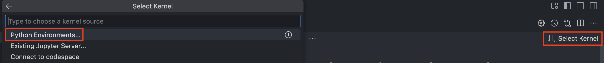
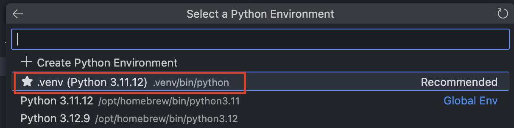
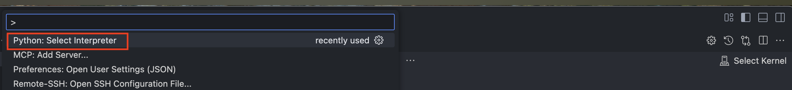

# Korean language proficiency evaluation for LLM/SLM models using KMMLU, CLIcK, and HAE-RAE dataset

## Overview

With the continuous emergence of various LLM/SLM models, there is a need for robust evaluation datasets for non-English languages such as Korean. KMMLU (Korean Massive Multi-task Language Understanding), CLIcK (Cultural and Linguistic Intelligence in Korean) and HAE_RAE_BENCH 1.0 fill this gap by providing a rich, well-categorized dataset that focuses on cultural and linguistic aspects, enabling detailed evaluation of Korean language models. This code performs benchmarking on two datasets with minimal time and effort.

### CLIcK (Cultural and Linguistic Intelligence in Korean)
This dataset assesses Korean language proficiency in the subject areas of Korean Culture (History, Geography, Law, Politics, Society, Tradition, Economy, Pop culture) and Korean Language (Textual, Functional, Grammar). There are a total of 1,995 sample data in 11 categories. This dataset presents 4- or 5-choice multiple choice questions. Depending on the question, additional context is given.

- [Paper](https://arxiv.org/abs/2403.06412), [GitHub](https://github.com/rladmstn1714/CLIcK), [Hugging Face](https://huggingface.co/datasets/EunsuKim/CLIcK)

### HAE_RAE_BENCH 1.0
This dataset evaluates Korean language proficiency in the following 6 categories (General Knowledge, History, Loan Words, Rare Words, Reading Comprehension, Standard Nomenclature). Similar to CLiCK, the task is to solve multiple-choice questions, but no additional context. There are a total of 1,538 sample data in 6 categories.

- [Paper](https://arxiv.org/abs/2309.02706), [GitHub](https://github.com/HAE-RAE/HAE-RAE-BENCH), [Hugging Face](https://huggingface.co/datasets/HAERAE-HUB/HAE_RAE_BENCH_1.0)

### KMMLU
The KMMLU dataset is a large-scale multi-task language understanding evaluation dataset in Korean. It is not a simple translation of the MMLU dataset, but rather data generated from Korean text, allowing us to evaluate how well LLM/SLM works in Korean. It consists of a total of 45 categories and 4 super categories, such as STEM, Appliced ​​Science, HUMSS, and Other.

- [Paper](https://arxiv.org/abs/2402.11548), [Hugging Face](https://huggingface.co/datasets/HAERAE-HUB/KMMLU)

### KMMLU-HARD
This dataset is an extended version of the KMMLU dataset, with more challenging questions. It is designed to further evaluate the limits of Korean NLP models and contains questions that require a particularly high level of comprehension and reasoning skills.

- [Paper](https://arxiv.org/abs/2402.11548), [Hugging Face](https://huggingface.co/datasets/HAERAE-HUB/KMMLU-HARD)


## Implementation

The code skeleton is based on https://github.com/corca-ai/evaluating-gpt-4o-on-CLIcK, but a lot of parts have changed. 

In particular, we modified the code to run on Azure OpenAI & Hugging Face and added logic for parallel processing, content filtering (400 error), and max request error (429 error) exception handling. 

## Results
🔥 Apr 17, 2025: Added **GPT-4.1** family benchmark results. GPT-4.1-mini is an improvement over GPT-4o-mini and is closer to GPT-4o. GPT-4.1 outperforms GPT-4o.

🔥 Feb 28, 2025: Added **Phi-4-mini-instruct** benchmark results.

🔥 Feb 2, 2025: Added **Phi-4** benchmark results / Added Azure AI Foundry deployment options. Phi-4 outperforms Phi-3.5-MoE in some metrics, such as CLIcK and KMMLU.

🔥 Aug 29, 2024: Added 5-shot experiments for **KMMLU** and **KMMLU-HARD** benchmark datasets. For Llama-3.1-8B-Instruct, adding an example with 5-shot does not give a proper answer based on Korean language. The results may vary depending on the experimental environment, but it seems that an appropriate system prompt is needed. (Please note that we did not use any system prompt.)

🔥 Aug 25, 2024: Added experimental results for **KMMLU** and **KMMLU-HARD** benchmark datasets. Added **Phi-3-mini-128K-instruct (June version)** benchmark results.

🔥 Aug 22, 2024: Added **Phi-3-5-mini-instruct** and **Phi-3.5-MoE-instruct** benchmark results. Phi-3.5 is Microsoft's latest open source model that has begun to properly support multiple languages, and its Korean performance has been greatly improved, as shown in the benchmark results below.

🔥 Aug 22, 2024: Added **Llama-3-1-8B-instruct** benchmark results. Of course, fine-tuned Llama-3.1 with Korean dataset may perform better, but we only compared it with the vanilla model.

🔥 Aug 9, 2024: Added Azure OpenAI **GPT-3.5-turbo (2023-06-13)**, **GPT-4-turbo (2024-04-09)**, **GPT-4o (2024-05-13)**, and **GPT-4o-mini (2024-07-18)** benchmark results.

### Notes
The numbers in the table below are the average accuracy (%). For Azure OpenAI models, a few questions are filtered out due to the content filtering feature, but this only happens between 1-5 samples in the entire dataset, so the impact is not significant. 

The prompt is the same as the CLIcK paper prompt. The experimental results may vary depending on the system prompt, context, and parameters. The experimental results below were given with max_tokens=512, temperature=0.01 without using few-shot, context, or system prompt.

Since most of them are ChatCompletion or instruction fine-tuned models, the variation may be large compared to the results of other group's experiments. However, our experimental results show that the trend follows similarly under the same experimental conditions. (e.g., GPT-4o: 70.57/GPT-4o-mini: 60.31 in Experimental Condition 1; GPT-4o: 67.76/GPT-4o-mini: 57.53 in Experimental Condition 2).


- GPT-4.1: 2025-04-14 model version
- GPT-4.1-mini: 2025-04-14 model version
- GPT-4.1-nano: 2025-04-14 model version
- GPT-4o: 2024-05-13 model version
- GPT-4o-mini: 2024-07-18 model version
- GPT-4-turbo: 2024-04-09 model version
- GPT-3.5-turbo: 2023-06-13 model version


### CLIcK

#### Open-Source models
- Accuracy by supercategory

| supercategory   |   Phi-4-mini-instruct |   Phi-4 |   Phi-3.5-mini-instruct |   Phi-3.5-MoE-instruct |   Phi-3-mini-128k-instruct-June |   Llama-3.1-8B-Instruct |
|:----------------|----------------------:|--------:|------------------------:|-----------------------:|--------------------------------:|------------------------:|
| Culture         |                 43.05 |   57.84 |                   43.77 |                  58.44 |                           29.74 |                   51.15 |
| Language        |                 42.31 |   61.85 |                   41.38 |                  52.31 |                           27.85 |                   40.92 |
| **Overall**     |                 42.81 |   59.15 |                   42.99 |                  56.44 |                           29.12 |                   47.82 |

- Accuracy by category

| supercategory   | category    |   Phi-4-mini-instruct |   Phi-4 |   Phi-3.5-mini-instruct |   Phi-3.5-MoE-instruct |   Phi-3-mini-128k-instruct-June |   Llama-3.1-8B-Instruct |
|:----------------|:------------|----------------------:|--------:|------------------------:|-----------------------:|--------------------------------:|------------------------:|
| Culture         | Economy     |                 59.32 |   76.27 |                   61.02 |                  77.97 |                           28.81 |                   66.1  |
| Culture         | Geography   |                 39.69 |   55.73 |                   45.8  |                  60.31 |                           29.01 |                   54.2  |
| Culture         | History     |                 27.5  |   27.5  |                   26.15 |                  33.93 |                           30    |                   29.64 |
| Culture         | Law         |                 36.99 |   50.23 |                   32.42 |                  52.51 |                           22.83 |                   44.29 |
| Culture         | Politics    |                 52.38 |   76.19 |                   54.76 |                  70.24 |                           33.33 |                   59.52 |
| Culture         | Pop Culture |                 63.41 |   70.73 |                   60.98 |                  80.49 |                           34.15 |                   60.98 |
| Culture         | Society     |                 52.75 |   75.08 |                   54.37 |                  74.43 |                           31.72 |                   65.05 |
| Culture         | Tradition   |                 45.5  |   66.67 |                   47.75 |                  58.11 |                           31.98 |                   54.95 |
| Language        | Functional  |                 42.4  |   66.4  |                   37.6  |                  48    |                           24    |                   32.8  |
| Language        | Grammar     |                 28.33 |   40    |                   27.5  |                  29.58 |                           23.33 |                   22.92 |
| Language        | Textual     |                 54.04 |   78.25 |                   54.74 |                  73.33 |                           33.33 |                   59.65 |

#### Proprietary models

- Accuracy by supercategory

| supercategory   |   GPT-4.1 |   GPT-4.1-mini |   GPT-4.1-nano |   GPT-4o |   GPT-4o-mini |   GPT-4-turbo |   GPT-3.5-turbo |
|:----------------|----------:|---------------:|---------------:|---------:|--------------:|--------------:|----------------:|
| Culture         |     81.65 |          72.81 |          62.47 |    81.89 |         70.95 |         73.61 |           53.38 |
| Language        |     78.31 |          70.62 |          58.62 |    77.54 |         63.54 |         71.23 |           46    |
| **Overall**     |     80.55 |          72.09 |          61.21 |    80.46 |         68.5  |         72.82 |           50.98 |

- Accuracy by category

| supercategory   | category    |   GPT-4.1 |   GPT-4.1-mini |   GPT-4.1-nano |   GPT-4o |   GPT-4o-mini |   GPT-4-turbo |   GPT-3.5-turbo |
|:----------------|:------------|----------:|---------------:|---------------:|---------:|--------------:|--------------:|----------------:|
| Culture         | Economy     |     94.92 |          84.75 |          86.44 |    94.92 |         83.05 |         89.83 |           64.41 |
| Culture         | Geography   |     80.92 |          78.63 |          64.89 |    80.15 |         77.86 |         82.44 |           53.44 |
| Culture         | History     |     68.52 |          51.11 |          38.89 |    66.92 |         48.4  |         46.4  |           31.79 |
| Culture         | Law         |     71.23 |          58.45 |          48.4  |    70.78 |         57.53 |         61.19 |           41.55 |
| Culture         | Politics    |     89.29 |          82.14 |          75    |    88.1  |         83.33 |         89.29 |           65.48 |
| Culture         | Pop Culture |    100    |          87.8  |          85.37 |    97.56 |         85.37 |         92.68 |           75.61 |
| Culture         | Society     |     91.26 |          86.73 |          77.67 |    92.88 |         85.44 |         86.73 |           71.2  |
| Culture         | Tradition   |     85.14 |          81.08 |          67.12 |    87.39 |         74.77 |         79.28 |           55.86 |
| Language        | Functional  |     87.2  |          73.6  |          53.6  |    84.8  |         64.8  |         80    |           40    |
| Language        | Grammar     |     60    |          50    |          40.42 |    57.08 |         42.5  |         47.5  |           30    |
| Language        | Textual     |     89.82 |          86.67 |          76.14 |    91.58 |         80.7  |         87.37 |           62.11 |

### HAE_RAE_BENCH 1.0

#### Open-Source models

| category              |   Phi-4-mini-instruct |   Phi-4 |   Phi-3.5-MoE-instruct |   Phi-3.5-mini-instruct |   Phi-3-mini-128k-instruct-June |   Llama-3.1-8B-Instruct |
|:----------------------|----------------------:|--------:|-----------------------:|------------------------:|--------------------------------:|------------------------:|
| General Knowledge     |                 28.41 |   38.07 |                  39.77 |                   31.25 |                           28.41 |                   34.66 |
| History               |                 31.38 |   37.77 |                  60.64 |                   32.45 |                           22.34 |                   44.15 |
| Loan Words            |                 52.66 |   61.54 |                  70.41 |                   47.93 |                           35.5  |                   63.31 |
| Rare Words            |                 51.6  |   62.72 |                  63.95 |                   55.06 |                           42.96 |                   63.21 |
| Reading Comprehension |                 43.18 |   71.14 |                  64.43 |                   42.95 |                           41.16 |                   51.9  |
| Standard Nomenclature |                 54.9  |   63.4  |                  66.01 |                   44.44 |                           32.68 |                   58.82 |
| **Overall**           |                 44.47 |   59.23 |                  61.83 |                   44.21 |                           36.41 |                   53.9  |

#### Proprietary models

| category              |   GPT-4.1 |   GPT-4.1-mini |   GPT-4.1-nano |   GPT-4o |   GPT-4o-mini |   GPT-4-turbo |   GPT-3.5-turbo |
|:----------------------|----------:|---------------:|---------------:|---------:|--------------:|--------------:|----------------:|
| General Knowledge     |     75.57 |          52.27 |          43.18 |    77.27 |         53.41 |         66.48 |           40.91 |
| History               |     93.62 |          89.89 |          64.89 |    92.02 |         84.57 |         78.72 |           30.32 |
| Loan Words            |     79.29 |          73.96 |          73.37 |    79.88 |         76.33 |         78.11 |           59.17 |
| Rare Words            |     88.15 |          83.7  |          76.54 |    87.9  |         81.98 |         79.01 |           61.23 |
| Reading Comprehension |     86.35 |          82.55 |          67.11 |    85.46 |         77.18 |         80.09 |           56.15 |
| Standard Nomenclature |     87.58 |          78.43 |          73.86 |    88.89 |         75.82 |         79.08 |           53.59 |
| **Overall**           |     85.83 |          78.93 |          67.95 |    85.7  |         76.4  |         77.76 |           52.67 |

### KMMLU (0-shot)

#### Open-Source models

| supercategory   |   Phi-4-mini |   Phi-4 |   Phi-3.5-MoE-instruct |   Phi-3.5-mini-instruct |   Phi-3-mini-128k-instruct-June |   Llama-3.1-8B-Instruct |
|:----------------|-------------:|--------:|-----------------------:|------------------------:|--------------------------------:|------------------------:|
| Applied Science |        36.46 |   47.97 |                  45.15 |                   35.8  |                           31.68 |                   37.03 |
| HUMSS           |        35.52 |   54.27 |                  49.75 |                   31.56 |                           26.47 |                   37.29 |
| Other           |        36.26 |   49.07 |                  47.24 |                   35.45 |                           31.01 |                   39.15 |
| STEM            |        39.31 |   52    |                  49.08 |                   38.54 |                           31.9  |                   40.42 |
| **Overall**     |        37.08 |   50.3  |                  47.43 |                   35.87 |                           30.82 |                   38.54 |

#### Proprietary models

| supercategory   |   GPT-4.1 |   GPT-4.1-mini |   GPT-4.1-nano |   GPT-4o |   GPT-4o-mini |   GPT-4-turbo |   GPT-3.5-turbo |
|:----------------|----------:|---------------:|---------------:|---------:|--------------:|--------------:|----------------:|
| Applied Science |     54.9  |          49.3  |          42.6  |    56.4  |         43.7  |         47.3  |           35.7  |
| HUMSS           |     70.57 |          62.29 |          49.26 |    68.5  |         54.76 |         60.85 |           39.28 |
| Other           |     70.09 |          64.19 |          55.22 |    68.31 |         58.19 |         63.11 |           45.47 |
| STEM            |     63.24 |          56.07 |          46    |    61.55 |         49.38 |         55.19 |           36.74 |
| **Overall**     |     65.49 |          59.26 |          48.57 |    64.26 |         52.63 |         58.75 |           40.3  |

### KMMLU-HARD (0-shot)

#### Open-Source models

| supercategory   |   Phi-4-mini-instruct |   Phi-4 |   Phi-3.5-MoE-instruct |   Phi-3.5-mini-instruct |   Phi-3-mini-128k-instruct-June |   Llama-3.1-8B-Instruct |
|:----------------|----------------------:|--------:|-----------------------:|------------------------:|--------------------------------:|------------------------:|
| Applied Science |                 26.02    |   24    |                  25.83 |                   27.08 |                           26.17 |                   26.25 |
| HUMSS           |                 23.09 |   22.88 |                  21.52 |                   20.21 |                           24.38 |                   20.21 |
| Other           |                 23.19 |   22.73 |                  24.82 |                   23.05 |                           24.82 |                   23.88 |
| STEM            |                 22.25 |   24.25 |                  28.18 |                   24.36 |                           26.91 |                   24.64 |
| **Overall**     |                 25.27 |   24.24 |                  25.34 |                   24    |                           25.68 |                   24.03 |

#### Proprietary models

| supercategory   |   GPT-4.1 |   GPT-4.1-mini |   GPT-4.1-nano |   GPT-4o |   GPT-4o-mini |   GPT-4-turbo |   GPT-3.5-turbo |
|:----------------|----------:|---------------:|---------------:|---------:|--------------:|--------------:|----------------:|
| Applied Science |     38    |          33.71 |          23.43 |    34    |         22    |         24    |           22    |
| HUMSS           |     42.48 |          38.22 |          23.17 |    41.62 |         22.68 |         29.39 |           16.36 |
| Other           |     43.34 |          33.84 |          24.45 |    40.91 |         29.68 |         30.48 |           25.94 |
| STEM            |     44.45 |          36.55 |          25.64 |    39.5  |         28.5  |         29.5  |           20.25 |
| **Overall**     |     42.79 |          35.6  |          24.34 |    39.62 |         24.56 |         30.56 |           20.97 |


### [Detailed results for each category](DETAILED_RESULTS.md)

## Quick Start

### GitHub Codespace
Please start a new project by connecting to Codespace Project. The environment required for hands-on is automatically configured through devcontainer, so you only need to run a Jupyter notebook.

### Your Local PC
Please start by installing the required packages on your local PC through uv.

```bash
uv sync
```

To use Jupyter Notebook in VS Code or Cursor, choose one of the two methods below:
1. Click **Select Kernel** - **Python Environments**, and then select **.venv**.


2. Click **Python: Select Interpreter** with the shortcut **Ctrl + Shift + P (Windows/Linux)**, **Cmd + Shift + P (macOS)**, and then select **.venv**.


Please do not forget to modify the `.env` file to match your account. Rename `.env.sample` to `.env` or copy and use it

### Modify your `.env`

#### Azure OpenAI
```ini
AZURE_OPENAI_ENDPOINT=<YOUR_OPEN_ENDPOINT>
AZURE_OPENAI_API_KEY=<YOUR_OPENAI_API_KEY>
AZURE_OPENAI_API_VERSION=<YOUR_OPENAI_API_VERSION>
AZURE_OPENAI_DEPLOYMENT_NAME=<YOUR_DEPLOYMENT_NAME> (e.g., gpt-4o-mini)
OPENAI_MODEL_VERSION=<YOUR_OPENAI_MODEL_VERSION> (e.g., 2024-07-18)>
```

#### Azure AI Foundry
```ini
AZURE_AI_INFERENCE_KEY=<YOUR_API_KEY>
AZURE_AI_INFERENCE_ENDPOINT=https://<YOUR_ENDPOINT_NAME>.services.ai.azure.com/models
AZURE_AI_DEPLOYMENT_NAME=Phi-4
```

#### OpenAI
```ini
OPENAI_API_KEY=<YOUR_OPENAI_API_KEY>
OPENAI_DEPLOYMENT_NAME=<YOUR_OPENAI_API_VERSION>
OPENAI_MODEL_VERSION=<YOUR_OPENAI_MODEL_VERSION> (e.g., 2024-07-18)
```

#### Azure ML
You can create endpoints by provisioning a managed compute host or using the serverless option.
For Phi-3.5, if you do not have a managed GPU compute quota, you can temporarily use Microsoft's shared quota for 168 hours. For more information, please refer to these links: [Phi-3.5 deployment](https://learn.microsoft.com/en-us/azure/ai-studio/how-to/deploy-models-phi-3?tabs=phi-3-5&pivots=programming-language-python), [Azure ML deployment](https://learn.microsoft.com/en-us/azure/machine-learning/tutorial-deploy-model)
```ini
AZURE_ML_DEPLOYMENT_NAME=<YOUR_ML_DEPLOYMENT_NAME>
AZURE_ML_ENDPOINT_URL=<YOUR_ML_ENDPOINT_URL>
AZURE_ML_ENDPOINT_TYPE=<YOUR_ML_ENDPOINT_TYPE> (dedicated or serverless)
AZURE_ML_API_KEY=<YOUR_ML_API_KEY>
```

#### Hugging Face
Please refer to [this guide](https://huggingface.co/docs/hub/security-tokens) to generate a Hugging Face token.
```ini
HF_API_TOKEN=<YOUR_HF_API_TOKEN>
```

Execute the command to perform the evaluation. (The evaluation results are saved in the `./results` folder and `./evals`.)
Below is an example.
   
```bash
#!/bin/bash
model_provider="azureopenai"

# CLIcK
uv run python click_main.py \
      --model_provider "$model_provider" \
      --batch_size 20 \
      --max_tokens 512 \
      --temperature 0.01 \
      --template_type basic

# HAERAE
uv run python haerae_main.py \
      --model_provider "$model_provider" \
      --batch_size 20 \
      --max_tokens 512 \
      --temperature 0.01 \
      --template_type basic

# KMMLU
uv run python kmmlu_main.py \
      --model_provider "$model_provider" \
      --batch_size 20 \
      --max_tokens 512 \
      --temperature 0.01 \
      --template_type basic \
      --is_hard False
```

### Tunable parameters
```python
parser.add_argument("--is_debug", type=bool, default=True)
parser.add_argument("--num_debug_samples", type=int, default=20)
parser.add_argument("--model_provider", type=str, default="azureopenai")
parser.add_argument("--hf_model_id", type=str, default="mistralai/Mistral-7B-Instruct-v0.2")
parser.add_argument("--batch_size", type=int, default=10)
parser.add_argument("--max_retries", type=int, default=3)
parser.add_argument("--max_tokens", type=int, default=256)
parser.add_argument("--temperature", type=float, default=0.01)
parser.add_argument("--template_type", type=str, default="basic")
```

azure-gpt-4o-mini Benchmark results (temperature=0.0)
```bash
   category_big     category   correct
0       Culture      Economy  0.830508
1       Culture    Geography  0.778626
2       Culture      History  0.484000
3       Culture          Law  0.575342
4       Culture     Politics  0.833333
5       Culture  Pop Culture  0.853659
6       Culture      Society  0.857605
7       Culture    Tradition  0.743243
8      Language   Functional  0.648000
9      Language      Grammar  0.425000
10     Language      Textual  0.807018
```

## References

```bibtex
@misc{kim2024click,
      title={CLIcK: A Benchmark Dataset of Cultural and Linguistic Intelligence in Korean}, 
      author={Eunsu Kim and Juyoung Suk and Philhoon Oh and Haneul Yoo and James Thorne and Alice Oh},
      year={2024},
      eprint={2403.06412},
      archivePrefix={arXiv},
      primaryClass={cs.CL}
}

@misc{son2024haeraebenchevaluationkorean,
      title={HAE-RAE Bench: Evaluation of Korean Knowledge in Language Models}, 
      author={Guijin Son and Hanwool Lee and Suwan Kim and Huiseo Kim and Jaecheol Lee and Je Won Yeom and Jihyu Jung and Jung Woo Kim and Songseong Kim},
      year={2024},
      eprint={2309.02706},
      archivePrefix={arXiv},
      primaryClass={cs.CL},
      url={https://arxiv.org/abs/2309.02706}, 
}

@misc{son2024kmmlumeasuringmassivemultitask,
      title={KMMLU: Measuring Massive Multitask Language Understanding in Korean}, 
      author={Guijin Son and Hanwool Lee and Sungdong Kim and Seungone Kim and Niklas Muennighoff and Taekyoon Choi and Cheonbok Park and Kang Min Yoo and Stella Biderman},
      year={2024},
      eprint={2402.11548},
      archivePrefix={arXiv},
      primaryClass={cs.CL},
      url={https://arxiv.org/abs/2402.11548}, 
}
```